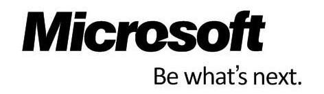

### RubyConf 2014 Lightning Talk

# How to deploy your Rails application on Windows

shesee

---

## shesee

Rails developer @ Taipei

* Ruby Taiwan Community
* Ruby Conf 2014 staff
* Rails Girls Coach
* Traffic-related engineering
* 5xRuby Inc.
* Optimis Corp.

---


### They said

### Rails hates Windows

---
### They said

### Rails hates Windows

# True story.

---

## True stroy


A rails application

needs to be deployed on _**Windows server 2003**_


---

## True stroy


A rails application

needs to be deployed on _**Windows server 2003**_

```ruby
>> 2013.years - 2003.years

=> 10 years
```


---

# Enviroment

### 10+ years old machine


* Windows server 2003
* IIS 6

---

# There's Plan A

### Helicon Zoo

A repository of web frameworks and applications
for Microsoft IIS

[http://www.helicontech.com/zoo/](http://www.helicontech.com/zoo/)


---

# There's Plan A

### Helicon Zoo

A repository of web frameworks and applications
for Microsoft IIS

## But not for the 10 years old Windows system


---

### Plan B
## Setting Rails enviroment

RailsInstaller(http://railsinstaller.org)


It's _**simple**_ and friendly for Microsoft users :)

---

### Plan B
## Setting Rails enviroment

There's a bisic rails application,
you might need to be

```
$ gem install bundler
$ gem install rake
$ bundle install
$ rake assets:precompile
```

etc...

---

### Plan B
## gem 'thin'

This is our rails application server,
which actually response the request.

```
$ thin --prefix=/yourapp -e production
```

---

### Plan B
## Reverse proxy server

This is our plan:
Make IIS 6 been a reverse proxy server !


---

### Plan B
## Reverse proxy server - IIS6 with IIRF2.1

We need something
to turn IIS6 to be a reverse proxy server

IIRF 2.1
(http://iirf.codeplex.com/releases/view/58734)


---

### Plan B
## East install

_**Next, next and more next**_


---

### Plan B
## Successful <3

Checkout ISAPI


---

### Plan B
## Put it under IIS 6

Put the "_**public**_" folder under IIS 6
[Setting its URI]

And adding an _**IIRF.ini**_ (config), it suppports regex


---

### Plan B
## Put it under IIS 6

Put the "_**public**_" folder under IIS 6
[Setting its URI]

And adding an _**IIRF.ini**_ (config), it suppports regex

### Example

```
RewriteLog AppPath\log\iirf.log

ProxyPass ^/(.*)$      http://localhost:3000/$1 [I]
```


---

### Plan B
## However you get a nacked website


Cause the _**URI**_ path, asset pipeline can't be the default path now.


---

### Plan B
## However you get a nacked website


Cause the _**URI**_ path, asset pipeline can't be the default path now.


### Solution

Also put the "_**assets**_" folder under IIS 6 

Original: http://```domain```

New: http://```domain```/_**URI**_


---

### Plan B
## Review our action

1. Install _**RubyInstaller**_

---

### Plan B
## Review our action

1. Install _**RubyInstaller**_
2. Install _**gem**_ & _**bundler**_ 


---

### Plan B
## Review our action

1. Install _**RubyInstaller**_
2. Install _**gem**_ & _**bundler**_ 
3. Install _**IIRF 2.1**_

---

### Plan B
## Review our action

1. Install _**RubyInstaller**_
2. Install _**gem**_ & _**bundler**_ 
3. Install _**IIRF 2.1**_
4. Put on IIS


---

### Plan B
## Review our action

1. Install _**RubyInstaller**_
2. Install _**gem**_ & _**bundler**_ 
3. Install _**IIRF 2.1**_
4. Put on IIS
5. Add _**public/iirf.ini**_

---

## You just need to
## click "next"




---


# Thanks.

## Download this slides


Clone from Github: 
_**https://github.com/CarolHsu/Rubyconf2014LT**_


Or Your can find my slideshare:
_**http://www.slideshare.net/hsuc12/how-to-deploy-your-rails-application-on-windows**_
