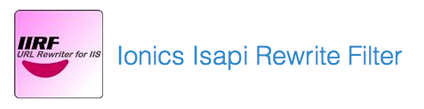

### RubyConf 2014 Lightning Talk

# How to deploy your Rails application on Windows

shesee

---

## shesee

Rails developer @ Taipei

* Ruby Taiwan Community
* Ruby Conf 2014 staff
* Rails Girls Coach
* Traffic-related engineering
* 5xRuby Inc.
* Optimis Corp.

---


### They said

### Rails hates Windows

---
### They said

### Rails hates Windows

# True story.

---

## True stroy


A rails application

needs to be deployed on _**Windows server 2003**_


---

## True stroy


A rails application

needs to be deployed on _**Windows server 2003**_

```ruby
>> 2013.years - 2003.years

=> 10 years
```


---

# Enviroment

### 10+ years old machine


* Windows server 2003
* IIS 6

---

# There's Plan A

### Helicon Zoo

A repository of web frameworks and applications
for Microsoft IIS

[http://www.helicontech.com/zoo/](http://www.helicontech.com/zoo/)


---

# There's Plan A

### Helicon Zoo

A repository of web frameworks and applications
for Microsoft IIS

## But not for the 10 years old Windows system


---

### Plan B
## Setting Rails enviroment

RailsInstaller(http://railsinstaller.org)


It's _**simple**_ and friendly for Microsoft users :)

---

### Plan B
## Setting Rails enviroment

There's a bisic rails application,
you might need to be

```
$ gem install bundler
$ gem install rake
$ bundle install
$ rake assets:precompile
```

etc...

---

### Plan B
## gem 'thin'

This is our rails application server,
which actually response the request.

```
$ thin --prefix=/yourapp -e production
```

---

### Plan B
## Reverse proxy server

This is our plan:
Make IIS 6 been a reverse proxy server !


---

### Plan B
## Reverse proxy server - IIS6 with IIRF2.1

We need something
to turn IIS6 to be a reverse proxy server

IIRF 2.1
(http://iirf.codeplex.com/releases/view/58734)



---

### Plan B
## East install

_**Next, next and more next**_


---

### Plan B
## Successful <3

Checkout ISAPI


